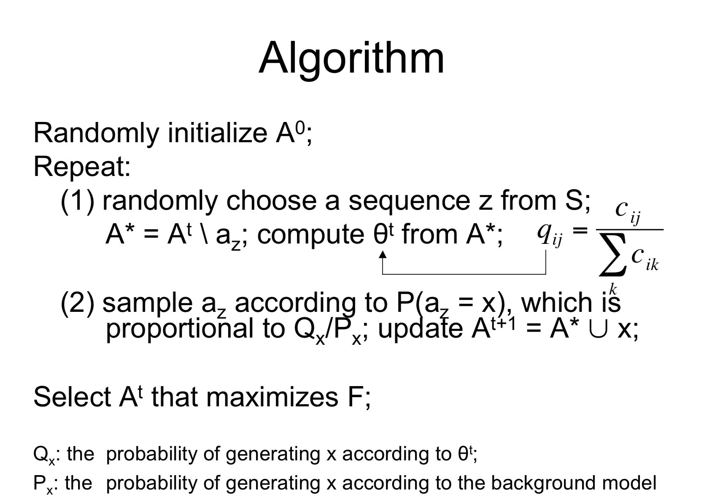

# MotifFinding
CS 412 project 2019
  
* project structure:  
  /benchmark for all the benchmark files  
  /charts for the output results of Part3  
  Please feel free to delete .py and add .ipynb if you prefer Jupyter   
  note.txt can be some note for yourself like what to say when demo, feel free to delete that if you don't need it  
  Remember to pull every time before you start 

* Version 1: Use Gibbs Sampler to find motif in sequences  
  
* Version 2 (if time permitted): add other algorithms (like Markov Chain?) and compare result